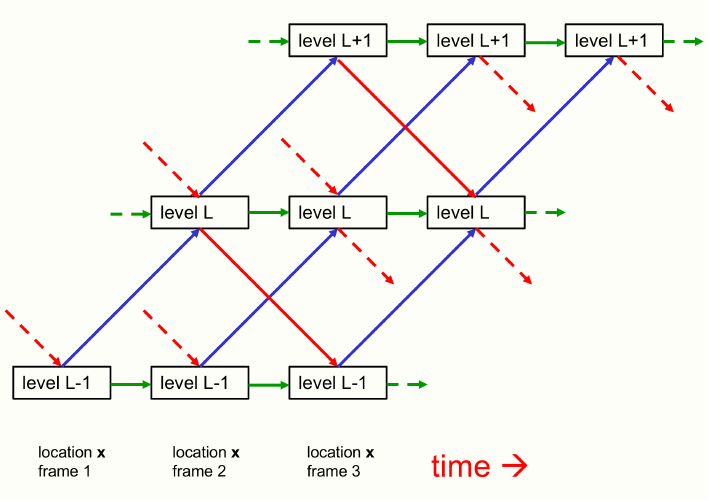
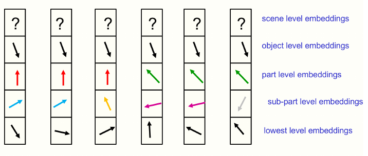

# GLOM Understanding Outline

## 1. Overview of the idea
- Representing part-whole hierarchies is fundamental to understanding images (and language, etc.)
- Difficult problem since neural networks cannot dynamically allocate neurons to represent an element of the hierarchy.
  - This was the initial motivation for capsule networks. Capnets allocate a group of neurons (capsule) to representing a level of the hierarchy at a region of an image.
  - In capnets, a parse tree can be created by activating a subset of these capsules and their connections
  - **Q**: Should we look into how exactly capnets create this parse tree?
  - **Q**: Is their a fundamental problem with this idea of dynamically allocating groups of neurons? Is this something that has been attempted in any other models?
- GLOM also uses capsules to represent part-whole hierarchies, but in a different way.
- GLOM operates as a sequential processing pipeline, so in vision, a single image would be treated as a sequence of frames.

### GLOM Architecture
- Composed of a large number of columns that use the same weights.
  - Each column is "a stack of spatially local autoencoders" that learn a multi-level representation for a particular part of an image.
  - **Q**: What is an autoencoder?
  - Each autoencoder uses a multilayer bottom-up encoder and a multi-layer top-down decoder to transform the embedding at one level to the next.
  - **Q** What are top-down and bottom-up encoders in this context? Capsule nets that act on the above and below embeddings respectively?
  
  - Shows the interaction within a single column.
  - Blue and red arrows represent bottom-up and top-down interactions. 
  - Green arrows can be "scaled residual connections that implement temporal smoothing of the embedding at each level"
  - **Q** Why do top-down interactions skip a frame?
- There are also interactions between embeddings at the same level in different columns, which make use of self-attention.
  - These are similar to the attention-weighted interactions between columns that represent word fragments in a multi-headed transformer.
  - Role is "to produce islands identical embeddings at a level by making each embedding vector at that level regress toward similar vectors at nearby locations."
  - **Q**: Why would these local "echo chambers" be desirable?
- In each column and at each point in time, the embedding is updated with the weighted average of four contributions:
  1. Output of bottom-up net acting on the embedding at L-1 at the previous time.
  2. Output of top-down net acting on embedding at L+1 at the previous time
  3. The embedding vector at the previous time.
  4. The attention-weighted average of the embeddings at the same levels in nearby columns at the previous time.
  - **Q**: This seems to mostly make sense.
- The "islands of similarity" allow GLOM to avoid the need to allocate groups of neurons to represent a node in the tree or set aside neurons for all nodes in advance.
- GLOM allocates an activity vector to represent a node and uses the same vector at all locations belonging to the node.
- The bottom-up and top-down nets allow a node to access its ancestors and descendents rather than through pointers.

- A picture of the embeddings at a particular time in six nearby columns.
  - The complete embedding includes the part-whole hierarchies shown in the figure. The actual embedding vectors are high-dimensional, not 2-D.

## 2. Introduction

**TODO**